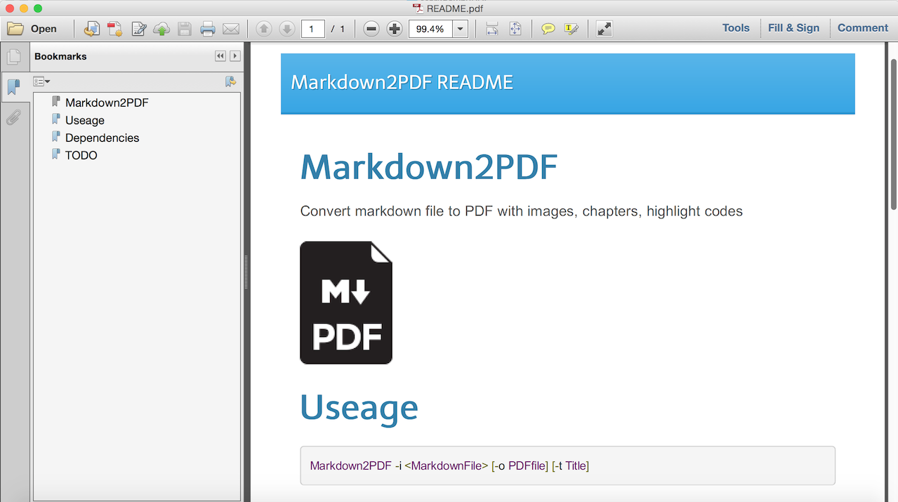

# Markdown2PDF
Convert markdown file to PDF with images, chapters, highlight codes


# Useage

```shell
Markdown2PDF -i <MarkdownFile> [-o PDFfile] [-t Title]
```

# Dependencies

- [strapdownjs](http://strapdownjs.com/)
- [wkhtmltopdf](http://wkhtmltopdf.org/)

# Screenshot

- Example PDF



# TODO

- Automatically check & download wkhtmltopdf 
- No title style
- Html template argument
- Mac OS support
- Batch convert support
- wkhtmltopdf arguments support

